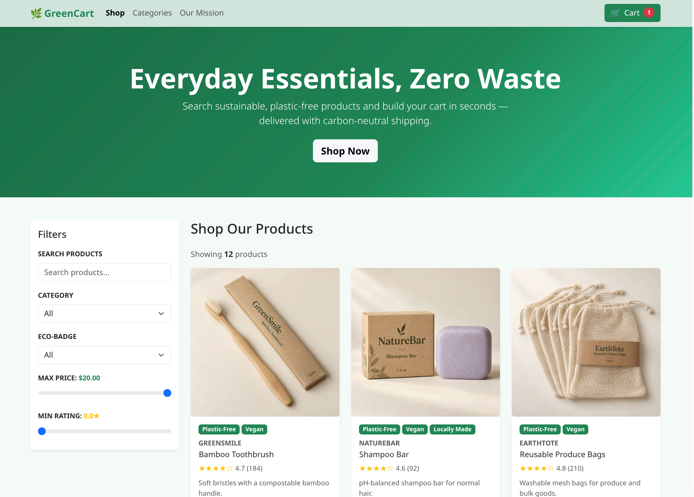

# GreenCart

An e-commerce web application for **GreenCart**, an online retailer of sustainable
household goods, personal care items, and pantry staples (refillable cleaning
sprays, bamboo toothbrushes, shampoo bars, reusable food storage bags,
eco-friendly laundry detergent, locally sourced organic snacks, and more).

This project is built for a direct-to-consumer (B2C) shopping experience:
customers browse and search products, view product details, and manage a
shopping cart.

## Preview



## Tech stack

| Layer      | Technology                                   |
| ---------- | -------------------------------------------- |
| UI         | React 19 + TypeScript                        |
| Build tool | Vite 8                                       |
| Linting    | Oxlint                                       |
| Formatting | Prettier                                     |
| Styling    | Bootstrap 5.3                                |
| Data       | CSV file (`src/data/GreenCart_Products.csv`) |

## Prerequisites

You need **Node.js** and **npm** installed before running the project.

| Tool | Required version     | Notes                                                           |
| ---- | -------------------- | --------------------------------------------------------------- |
| Node | **20.19+ or 22.12+** | Vite 8 requires a modern Node LTS. **Node 22 LTS recommended.** |
| npm  | **10 or later**      | Ships with Node 20+. npm 11 is recommended.                     |

> This project was developed and tested with **Node v26.8.2** and
> **npm 12.0.2**. Any newer LTS release also works. Because the project uses
> `"type": "module"` and Vite 8, very old Node versions (16 and below) will
> **not** work.

Check your versions:

```bash
node --version
npm --version
```

## Getting started

1. **Clone the repository and install dependencies:**

   ```bash
   npm install
   ```

2. **Start the development server:**

   ```bash
   npm run dev
   ```

   Open the URL printed in the terminal (usually <http://localhost:5173>).

## Available scripts

| Command           | Description                                                      |
| ----------------- | ---------------------------------------------------------------- |
| `npm run dev`     | Start the Vite dev server with hot-module reload.                |
| `npm run build`   | Type-check (`tsc -b`) and produce a production build in `dist/`. |
| `npm run preview` | Serve the production build locally to verify it.                 |
| `npm run lint`    | Run Oxlint over the project.                                     |

### Viewing a production build

Do **not** open `dist/index.html` directly from the filesystem (`file://`) —
browsers block ES modules over `file://` (you will see a CORS/MIME error).
Always serve the build over HTTP:

```bash
npm run build
npm run preview
```

Then open the URL it prints (usually <http://localhost:4173>).

If you prefer to serve the `dist/` folder with another static server, that works
too (for example `npx serve dist`), because the build uses relative asset paths.

## Deployment (GitHub Pages)

This project deploys automatically to **GitHub Pages** via GitHub Actions
(`.github/workflows/deploy.yml`). Every push to `main` builds the app and
publishes `dist/` — no build output is committed to the repository.

- **Live site:** <https://kh288.github.io/GreenCartApp/>

### One-time setup

In the repository, go to **Settings → Pages** and set **Build and deployment →
Source** to **GitHub Actions**. After that, each push to `main` triggers a
deploy (you can also run it manually from the **Actions** tab).

### Why it works from a subpath

The site is served from `/GreenCartApp/`, not the domain root. `vite.config.ts`
sets `base: "./"`, so all built asset URLs are **relative**. That means the same
build works whether it is served from a subpath, a custom domain, or a static
file server. A `public/.nojekyll` file is also included so GitHub Pages serves
every asset as-is.

## Project structure

```
.
├── index.html                      # Vite entry HTML
├── vite.config.ts                  # Vite configuration
├── .oxlintrc.json                  # Oxlint rules
├── .prettierrc                     # Prettier style
├── public/                         # Static assets served as-is
└── src/
    ├── main.tsx                    # React entry point
    ├── App.tsx                     # Top-level composition
    ├── types.ts                    # Shared types (Product, CartLine, etc.)
    ├── data/
    │   └── GreenCart_Products.csv  # Business product data
    ├── components/                 # Presentational React components
    │   ├── Navbar.tsx
    │   ├── Footer.tsx
    │   ├── Filters.tsx
    │   ├── Catalog.tsx
    │   ├── ProductCard.tsx
    │   ├── ProductDetail.tsx
    │   ├── CartPage.tsx
    │   ├── QuantityStepper.tsx
    │   ├── ProductImage.tsx
    │   ├── StarRating.tsx
    │   ├── BadgeList.tsx
    │   └── Toast.tsx
    ├── hooks/                      # Reusable stateful logic
    │   ├── useProducts.ts          # Loads the product catalog
    │   ├── useFilters.ts           # Search + filter state
    │   ├── useCart.ts              # Cart operations
    │   └── useToast.ts             # Transient status messages
    └── utils/
        ├── getCSV.ts               # CSV parsing + product mapping
        ├── cartStorage.ts          # Guest cart persistence (localStorage)
        ├── filterProducts.ts       # Pure filter/derive helpers
        └── format.ts               # Formatting helpers
```

## Data

Product data lives in **`src/data/GreenCart_Products.csv`**. Each row includes
the product ID, name, category, brand, price, size, description, ingredients,
sustainability flags, eco-badges, inventory, rating, review count, supplier,
certification, image filename, and related-product IDs.

The CSV is bundled into the app at build time via Vite's `?raw` import, so it
loads reliably in every environment without a network request. To update the
catalog, edit the CSV and re-run the build (or the dev server).

## Features implemented

The first half of the planned features (three user stories):

1. **Search and browse inventory** — keyword search plus category, eco-badge,
   price, and rating filters, with a results count and empty state.
2. **View product details** — image, brand, badges, rating, price, availability,
   description, ingredients/sourcing, a quantity selector, and related products.
3. **Add to cart and manage cart** — add, update quantity, and remove items,
   with line totals, a running subtotal, and a cart count in the navigation bar.
   The cart is **persisted in `localStorage`** for guest sessions and expires
   after **24 hours** without activity.

## Development notes

- **Node.js 20.19+ / 22.12+ is required** (Vite 8). Node 22 LTS is recommended.
- Run `npm run lint` and `npm run build` before committing to catch type and lint
  errors early.
